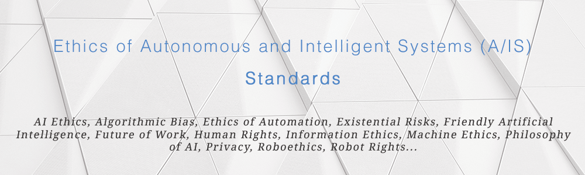

# A/IS Standards

 
     

_**See also:
[ais-ethics-open-groups](https://github.com/fititnt/ais-ethics-open-groups) |
[ais-ethics-orgs](https://github.com/fititnt/ais-ethics-orgs) |
ais-ethics-standards**_

---

  **Curated list of standards related to Ethics of Autonomous
and Intelligent Systems (A/IS).** AI Ethics, Algorithmic Bias, Ethics of
Automation, Existential Risks, Friendly Artificial Intelligence, Future of
Work, Human Rights, Information Ethics, Machine Ethics, Philosophy of AI,
Privacy, Roboethics, Robot Rights...

<!--
---

**TL;DR: if you are impatient, the documents you want with "everything" are on
[standards section](#standards) of this document.**

---
-->

> _"As we keep improving AI, AI researchers start running into standard human
problems that people have worked on for decades, centuries, or millenia, and
thinking they are the first ones to see them. e.g. defending minority
interests, international security, what does "fair" mean."_ — Joanna J Bryson

In addition to [technical standards](#standards) that focus explicitly in terms
related to A/IS Ethics, this document mentions others that, either by being
enforced by regional laws and/or have been discussed for much longer in a more
specific knowledge area of the A/IS of your interest, are very relevant.

<!--
Some very quick tips:

**aaaa**: aaaaa.

**bbb**: asdasdasd
-->

<!--
## Translations

- English (English): [fititnt/ais-ethics-standards](https://github.com/fititnt/ais-ethics-standards)
- Portuguese (Português): [fititnt/ais-ethics-standards-pt](https://github.com/fititnt/ais-ethics-standards-pt)

-->
---

# Laws
<!-- Standards enforced by law -->

## International Law

The following documents are used as a direct basis in [constitutions](https://en.wikipedia.org/wiki/List_of_national_constitutions)
and laws throughout all[1](#f1) the countries on Earth.

Protip:
the main link posted here is for the English version, but all these documents
have oficial translations for several languages. The most translated one
is [UDHR with 500+ translations](https://www.ohchr.org/EN/UDHR/Pages/SearchByLang.aspx).

| Region | Topic | Organization | Document |
| --- | --- | --- | --- |
| Worldwide [1](#f1) | Human Rights | United Nations | [Universal Declaration of Human Rights](https://www.ohchr.org/EN/UDHR/Pages/Language.aspx?LangID=eng) |
| Worldwide [1](#f1) | Human Rights | United Nations | [International Covenant on Civil and Political Rights, 1966](https://www.ohchr.org/Documents/ProfessionalInterest/ccpr.pdf) |
| Worldwide [1](#f1) | Human Rights | United Nations | [International Covenant on Economic, Social and Cultural Rights, 1965](http://www.ohchr.org/Documents/ProfessionalInterest/cescr.pdf) |
| Worldwide [1](#f1) [2](#f2) | Human Rights | United Nations | [Convention on the Elimination of All Forms of Discrimination against Women, 1979](http://www.un.org/womenwatch/daw/cedaw/cedaw.htm) |
| Worldwide [1](#f1) | Human Rights | United Nations | [International Convention on the Elimination of All Forms of Racial Discrimination](http://www.ohchr.org/Documents/ProfessionalInterest/cescr.pdf) |

## Transnational Law

| Region | Topic | Organization | Document |
| --- | --- | --- | --- |
| [European Union](https://en.wikipedia.org/wiki/Member_state_of_the_European_Union) | Data Protection | [European Commission](https://ec.europa.eu/) | [General Data Protection Regulation (GDPR)](https://eugdpr.org/) |
| _Undefined_ [3](#f3) | Human Rights | [Organisation of Islamic Cooperation](https://www.oic-oci.org/states/?lan=en) | Cairo Declaration on Human Rights in Islam, 1990 [3](#f3) |

## National Law

| Region | Topic | Organization | Document |
| --- | --- | --- | --- |
| China | Data Protection | Government of China | [信息安全技术 个人信息安全规范](https://www.tc260.org.cn/upload/2018-01-24/1516799764389090333.pdf) [gdpr-like](#gdpr-like)   _(via [csis.org](https://www.csis.org/analysis/chinas-emerging-data-privacy-system-and-gdpr))_|
| Brazil | Data Protection | Government of Brazil | [Lei Geral de Proteção de Dados Pessoais (LGPDP)](http://www.planalto.gov.br/ccivil_03/_Ato2015-2018/2018/Lei/L13709.htm) [gdpr-eq](#gdpr-eq) |

# Standards

_Important note: this area will need significative time to catalog standards
in a way that someone new could undestand more easily how these where developed._

| Region | Topic | Organization | Document |
| --- | --- | --- | --- |
| Worldwide | _Multiple_ | [The IEEE Global Initiative](https://ethicsinaction.ieee.org/) | [Ethically Aligned Design](https://standards.ieee.org/industry-connections/ec/auto-sys-form.html) [wip](#wip) |

# Code of Ethics
This area contains code of ethics, <strong id="code-of-conduct">code of conduct</strong> and <strong id="principles">principles</strong>.
In short, they serve as moral codes. They can restrict what you or your A/IS
could do beyond what is enforceable by regional laws.

## Professional

(...)

## Companies
These documents can serve as a public commitment as a company its employees
should act, but can be written in a way that inspires others out of such a
company to follow such recommendations.

| Company | Link |
| --- | --- |
| Google | [Responsible AI Practices](https://ai.google/education/responsible-ai-practices)

# Other

_TODO: these links need better classification on this document_

| Organization | Document |
| --- | --- |
| [Future Of Life](https://futureoflife.org/team/) | [Asilomar AI Principles](https://futureoflife.org/ai-principles/) |

# Science fiction

The following references have a very limited application as practical standards
and, therefore, are classified here as **science fiction**. They are explicitly
listed because they are popular and as a way to encourage people to understand
that there is a difference between them and others.

TL;DR: **do not use these references for non-fiction**, or at least educate the
audience of it's limitations.

| Region | Topic | Organization | Document |
| --- | --- | --- | --- |
| _"Science fiction"_ | Roboethics | [Isaac Asimov](https://en.wikipedia.org/wiki/Isaac_Asimov) | [Three Laws of Robotics (Asimov's Laws)](https://en.wikipedia.org/wiki/Three_Laws_of_Robotics) |
| _"Science fiction"_ | Roboethics | [Osamu Tezuka](https://en.wikipedia.org/wiki/Osamu_Tezuka) | Ten Principles of Robot Law / Astro Boy series |

<!--
Ten Principles of Robot Law / Astro Boy series, see https://akikok012um1.wordpress.com/japans-ten-principles-of-robot-law/
-->

# Footnotes

- <b id="wip">wip</b>: These documents are (at least at time of inclusion here) 
  "work in progress" or drafts and do not have at least their first version
  finished and ready to be used.
- <b id="gdpr-eq">like-gdpr</b>: These documents seems to be compatible to GDPR.
- <b id="gdpr-like">like-gdpr</b>: These documents seems to have similarities to
  GDPR (but maybe are not equivalent). It can be even more restrictive than
  GDPR on how to handle personal data.

- <b id="f1">1</b>: These treaties are followed by
[Member states of the United Nations](https://en.wikipedia.org/wiki/Member_states_of_the_United_Nations) (e.g near
_all_ territories), but some articles of each document may have minor objections.
See [Multilateral Treaties Deposited with the Secretary-General](https://treaties.un.org/Pages/ParticipationStatus.aspx?clang=_en)
for full details.

- <b id="f2">2</b> See [reservations on Convention on the Elimination of All Forms of Discrimination against Women](https://treaties.un.org/Pages/ViewDetails.aspx?src=IND&mtdsg_no=IV-8&chapter=4&clang=_en) [↩](#a2)

- <b id="f3">3</b>: Except for non-official copies or non-official
translations from the Cairo Declaration on Human Rights created on 1990, there
are no official links do download and the Organisation of Islamic Cooperation
does cite it's endorsement from this very specific document, but has references
like the [Statute of the OIC Women Development Organization](http://ww1.oic-oci.org/english/convenion/Statue_of_the_oic_women_development_org_en.pdf).
The Human Rights documents from United Nations with (if any) minor objections
seems to be a more reliable source in 2019, even for state members of OIC.

<!--
https://www.oic-oci.org/page/?p_id=40&p_ref=16&lan=en
http://ww1.oic-oci.org/english/convenion/Rights%20of%20the%20Child%20In%20Islam%20E.pdf

!!! https://www.brookings.edu/opinions/its-time-to-revise-the-cairo-declaration-of-human-rights-in-islam/ !!!

http://ww1.oic-oci.org/english/convenion/Statue_of_the_oic_women_development_org_en.pdf
->

<!--
https://www.csis.org/analysis/new-china-data-privacy-standard-looks-more-far-reaching-gdpr

-->

<!--
[1](#f1)
<b id="f1">1</b> Footnote content here. [↩](#a1)
-->

# Contributions
To discuss suggestions and criticisms, you can:

- [Open a issue](https://help.github.com/articles/creating-an-issue/)
- [Make a Pull request](https://help.github.com/articles/about-pull-requests/)
- Talk via e-mail:
  - with the maintainer: Emerson Rocha <rocha@ieee.org>.

<!--
Note: this work is under [Public Domain](UNLICENSE), so translations &
adaptations are OK.
-->

# License

<!--
  NOTE: You, as translator or as creator of a derivated work can change the
        License to something different from Public Domain or even remove
        the name from Emerson Rocha.
-->

To the extent possible under law, [Emerson Rocha](https://github.com/fititnt)
has waived all copyright and related or neighboring rights to this work to
[Public Domain](UNLICENSE).